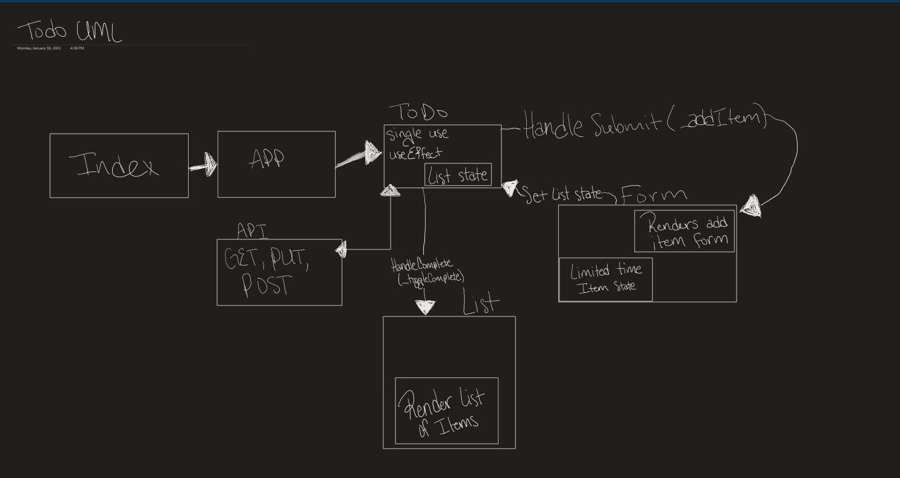

# LAB - Class 31 - 34

## Project: React To-do List Manager

### Author: Nathan Cox

### Links and Test Objects

### Resources

### Setup

#### Phase 1 (lab 31) Hooks API: User & Developer Stories

- [x] As a user, I would like an easy way to add a new to do item using an online interface.
- [x] As a user, I would like my to-do items to have an assignee, due date, difficulty meter, status and the task itself.
- [x] As a user, I would like to delete to-do items that are no longer needed.
- [x] As a user, I would like to mark to-do items as completed.
- [ ] As a user, I would like to edit an existing to do item.

---

- [x] Convert the architecture from Class-based Components into Functional Components.
- [x] Apply styling and layout using React Bootstrap Components.
- [x] Ensure the current functionality works unchanged.
- [x] Manage state using the useState() hook.
- [x] Use a useEffect() hook to change the title of the browser with the complete/incomplete counts.
- [x] Use a useEffect() hook to pre-load the seeded to-do items.
- [x] Match the provided mockup for the design.
- [x] Each item in the list should show the text of the item as well as the assignee.
- [x] When clicked, toggle the “complete” status of the item.
- [x] Items should be styled differently when complete/incomplete making their status visually obvious.

#### `.env` requirements (where applicable)

<!-- i.e.

- `PORT` - Port Number
- `MONGODB_URI` - URL to the running mongo instance/db -->

#### How to initialize/run your application (where applicable)

`npm start`

#### How to use your library (where applicable)

### Tests

- To run tests, type npm test in the command line from the root directory.
- Any tests of note?: N/A thus far.
- Describe any tests that you did not complete, skipped, etc.: All, for now.

### UML

